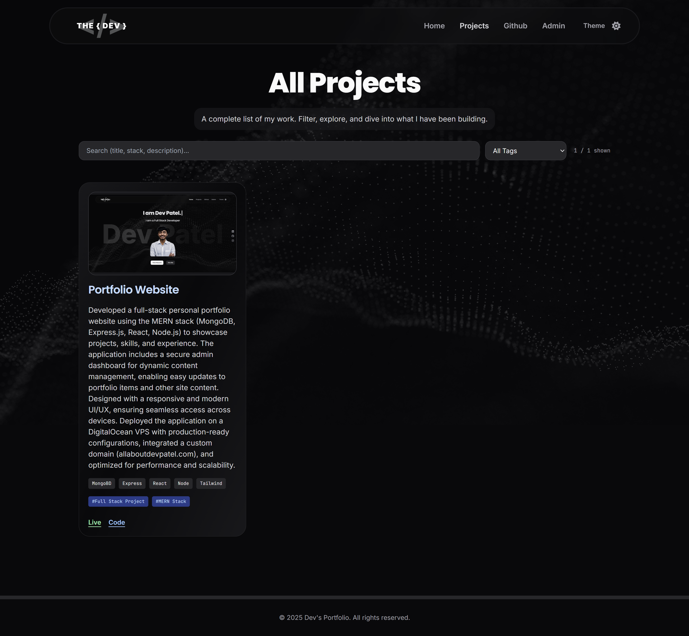
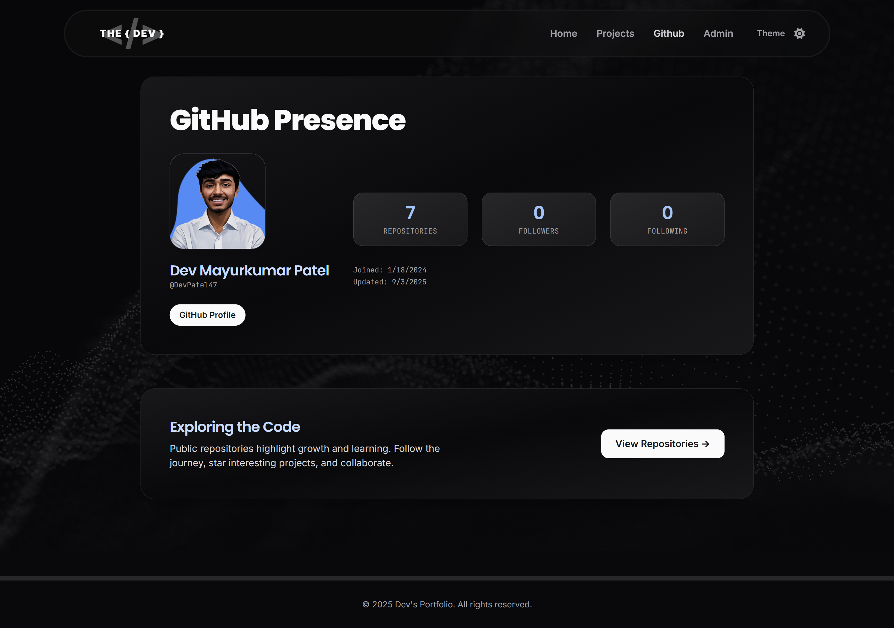
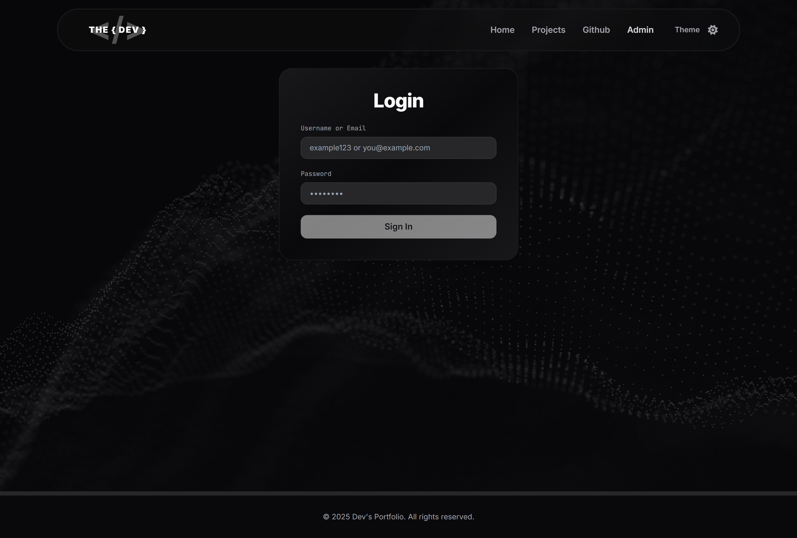
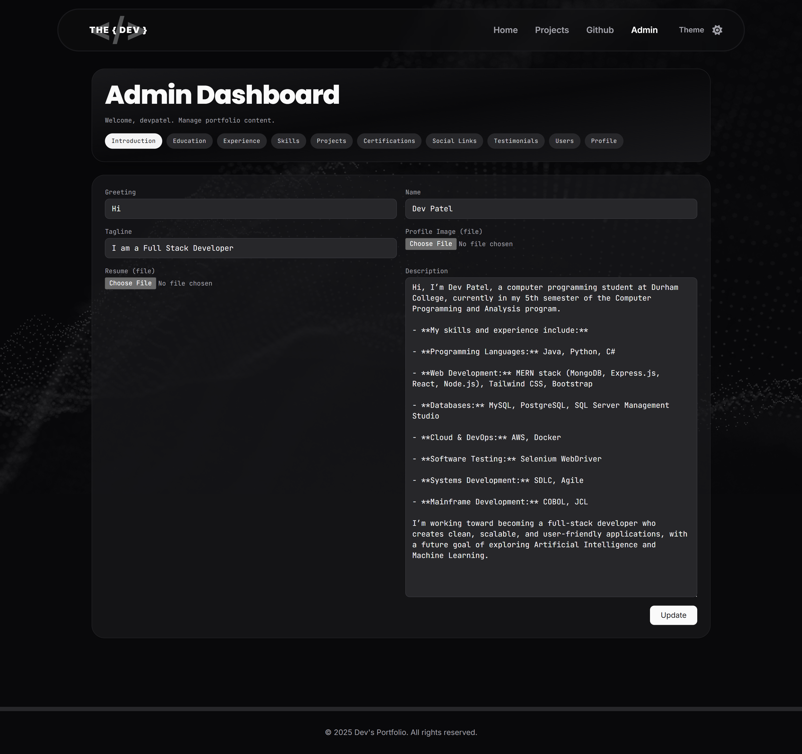

# Personal Portfolio Website (MERN Stack)

A full-stack portfolio website built with **MongoDB, Express.js, React, Node.js (MERN)**, featuring a **secure admin dashboard** to showcase projects, skills, and experience. Fully responsive and deployed on a **DigitalOcean VPS** with custom domain: **[allaboutdevpatel.com](https://allaboutdevpatel.com)**.

> ⚠️ **Note:** This repository is for **demonstration purposes only**. The code is **not intended for public reuse or cloning**.

---

## 🚀 Features

-   **Admin Dashboard** – Manage portfolio content dynamically (projects, blogs, skills)
-   **Responsive Design** – Optimized for mobile, tablet, and desktop devices
-   **Secure Backend** – Node.js and Express.js backend with authentication
-   **Database** – MongoDB for structured, scalable data storage
-   **Production Deployment** – Hosted on DigitalOcean VPS with NGINX and PM2
-   **Custom Domain** – [allaboutdevpatel.com](https://allaboutdevpatel.com)

---

## 🛠️ Tech Stack

| Layer      | Technology                   |
| ---------- | ---------------------------- |
| Frontend   | React, Tailwind CSS          |
| Backend    | Node.js, Express.js          |
| Database   | MongoDB                      |
| Deployment | DigitalOcean VPS, NGINX, PM2 |
| Domain     | allaboutdevpatel.com         |

---

## 🎨 Screenshots

### Home Page

### Projects Page

### GitHub Page

### Admin Login Page

### Admin Dashboard Page

---

## 📂 Repository Usage

This repository is **private for portfolio demonstration only**. It showcases my **full-stack development skills**, UI/UX design, and deployment process. The code **should not be cloned or reused**.

---

## 🌐 Live Demo

Check out the live portfolio here: [allaboutdevpatel.com](https://allaboutdevpatel.com)

---

## ✨ Author

**Dev Mayurkumar Patel**  
[GitHub](https://github.com/DevPatel47) | [Portfolio](https://allaboutdevpatel.com)
